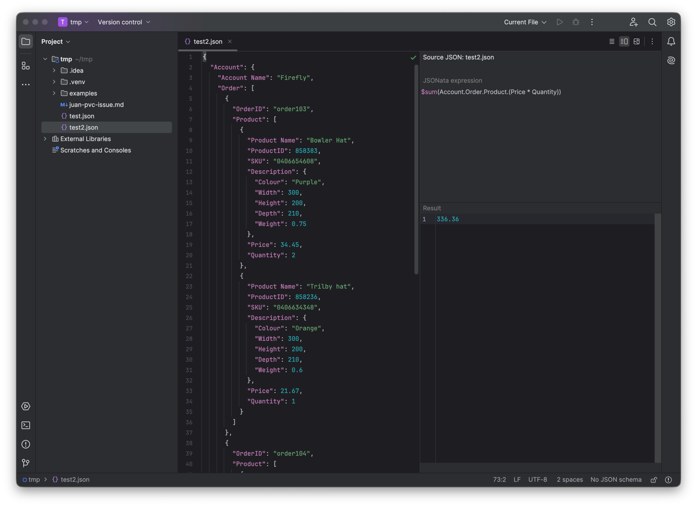

# JSONata for JetBrains IDEs

A plugin for working with [JSONata](https://jsonata.org/) in any JetBrains IDE built on the IntelliJ
Platform 2024.3+ (IntelliJ IDEA, PyCharm, WebStorm, GoLand, PhpStorm, RubyMine, CLion, Rider and more).
Open a panel over an open JSON file, write a JSONata expression and see the result right away — much
like [try.jsonata.org](https://try.jsonata.org/), but inside the IDE and wired directly to your JSON file.



## What it does

- **Live preview (per file).** JSON files open in a **split editor** (like Markdown):
  JSON on the left, playground on the right (expression on top, result below) — the preview always
  belongs to that one file; switch to another JSON and you see its own. It recomputes as you edit the
  JSON or the expression (debounced, off the EDT, with runtime limits against runaway loops).
- **Syntax highlighting** for the JSONata expression (custom lexer + language).
- **Error annotations** — the expression is compiled by the real engine; a syntax error is underlined
  in place.
- **Autocomplete** for both:
  - **the JSONata language** — built-in functions (with signatures) and keywords;
  - **the JSON structure** — field names for the current path under the cursor (the path is
    *evaluated* against the bound JSON, so it works even through predicates and function calls).
- **Parameter info** — the signature of a built-in function with the current argument highlighted.
- **Remembered per file** — the expression you last used for a JSON file is restored when you reopen it,
  including across IDE restarts.

Engine: [`com.dashjoin:jsonata`](https://github.com/dashjoin/jsonata-java) (a faithful port of jsonata.js).

## Usage

1. Open a JSON file — it opens in a split editor (by default just the editor, nothing in your way).
2. Reveal the preview with the **Editor / Split / Preview** switch in the top right, or the floating
   **Open JSONata Playground** button (and from the popup menu in the project tree).
3. JSON on the left, a playground bound to this file on the right. Type an expression; the result
   updates. Switch to another JSON and you see its own playground.
4. Autocomplete: `Ctrl+Space` — after `.` the JSON fields are offered (including inside `.( … )` blocks
   and `[ … ]` predicates, based on the actual context), after `$` the functions. Errors are underlined;
   **Ctrl+P** shows a function's signature.

## Custom functions

> ⚠️ **Temporarily disabled in the UI** (0.1.0) — the feature is complete in the code but hidden from
> the frontend until we fine-tune it. To enable: flip `CUSTOM_FUNCTIONS_ENABLED` to `true` (in
> `JsonataFeatureFlags.kt`) and uncomment the `projectConfigurable` registration in `plugin.xml`.

Two ways to add functions you call in an expression as `$myFunction(...)` — configuration lives in
**Settings ▸ Tools ▸ JSONata Playground** (per project):

1. **JSONata prelude** — definitions (`$double := function($x){ $x * 2 };`) are prepended to every expression.
2. **JVM functions from your project** — write a class implementing `cz.tix.jsonata.api.JsonataFunctionProvider`,
   compile the project, enable *Load custom functions* in Settings and add its FQN. The plugin loads it
   from the module output (with its own classloader) and binds the functions. A ready-made example to try
   in another repo: [`examples/custom-functions/`](examples/custom-functions/).

Registration lives in Settings, which is the source of truth.

The available functions appear in the “Custom functions” line in the panel and autocomplete
(`Ctrl+Space` after `$`).

> ⚠️ Loaded JVM code runs **unsandboxed in the IDE's JVM**, which is why it's an explicit opt-in (off by
> default) — only enable it for projects you trust.

## Running and development

```bash
./gradlew runIde          # launches a sandbox IDE with the plugin installed
./gradlew buildPlugin     # ZIP into build/distributions/
./gradlew test            # unit + headless-platform tests
./gradlew verifyPluginProjectConfiguration
```

### Build requirements
- IntelliJ Platform Gradle Plugin **2.16**, target IDE **IntelliJ IDEA Community 2024.3** (`sinceBuild 243`).
- The build runs on a **JDK 21 toolchain** (platform 2024.3 requires Java 21). No machine-specific JDK
  path is committed: the `foojay-resolver` plugin in `settings.gradle.kts` auto-provisions JDK 21 (and
  CI provides one via `setup-java`). To reuse a local JDK/JBR 21, add its path to `~/.gradle/gradle.properties`.
- The Gradle wrapper is pinned to 9.0.0.

## Architecture (in brief)

```
cz.tix.jsonata
├─ engine/        JsonataEvaluator (compile+eval with limits), JsonRenderer (pretty JSON)
├─ lang/          JsonataLanguage, FileType, Lexer, ParserDefinition (flat PSI),
│                 SyntaxHighlighter(+Factory), Annotator (engine-driven), ParameterInfoHandler
├─ completion/    JsonataExpressionScanner (cursor context, string/depth-aware),
│                 JsonataFieldKeys (field completion: “evaluate the prefix against the JSON”),
│                 JsonataBuiltins (function catalog), JsonataCompletionContributor
├─ editor/        JsonataSplitEditorProvider/SplitEditor/PreviewFileEditor (TextEditorWithPreview)
├─ toolwindow/    JsonataPlaygroundPanel (LanguageTextField expression + result; preview content)
├─ api/           JsonataFunctionProvider / JsonataFunctions / JsonataFn (ABI for custom functions)
├─ settings/      JsonataProjectSettings (registry), JsonataFunctionLoader (classloader), JsonataConfigurable
└─ actions/       OpenJsonataPlaygroundAction, JsonataFloatingToolbarProvider
```

## Known limitations / future work

- All JSON files open in a split editor (the preview is hidden by default, though).
- A full structural PSI parser (rename, find-usages for `$variables`) — not done; not needed for the
  current features.
- Field completion inside a lambda (`$map(a, function($v){ $v. })`) — has no scope for `$v`, falls back.
- Regex literals `/.../` are not lexed separately (the engine evaluates them correctly).
